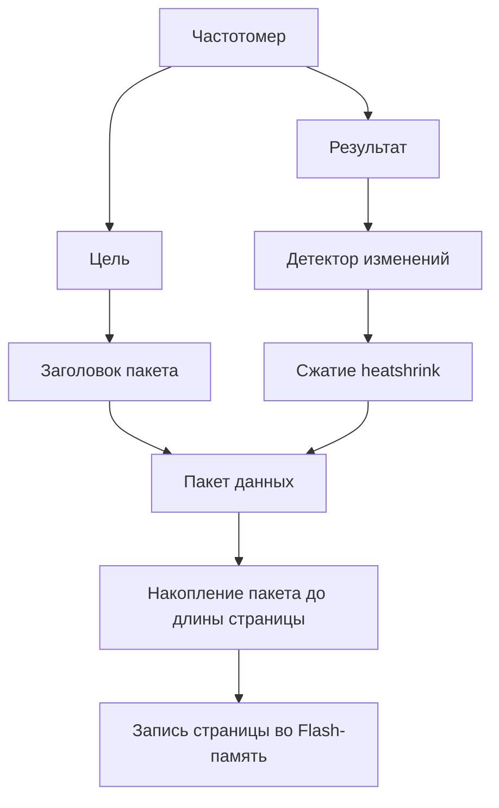

# Скважный самописец для STM32L433

Использует Flash-память `MT25QU01GBBB8E12` (128МБ) (или 2 шт.) через QSPI.
Представляется как USB-накопитель, на котором находится виртуальная файловая система FAT32 с содержимым Flash-памяти.

> [!warning] ПРОВЕРЯЙ какой кварц на плате
> Должен соответсвовать значению в `XTAL_FREQ`, кроме того конфигурация PLL должна быть настроена на получение частоты CPU 80 МГц.

## Аппаратное обеспечение


| Порт | Назначение              | Описание                                            |
| ---- | ----------------------- | --------------------------------------------------- |
|      | **OSC**                 | Внешний кварц 24 МГц                                |
| PH0  | OSC_IN                  |                                                     |
| PH1  | OSC_OUT                 |                                                     |
|      | **SWD**                 | Отладочный интерфейс                                |
| PA13 | SWDIO                   |                                                     |
| PA14 | SWCLK                   |                                                     |
|      | **USB**                 |                                                     |
| PA11 | USB_DM                  | USB D-                                              |
| PA12 | USB_DP                  | USB D+                                              |
|      | **Частотные входы**     |                                                     |
| PA8  | F_TEMP                  | Вход частоты температуры (TIM)                      |
| PA5  | F_PRES                  | Вход частоты давления (TIM)                         |
|      | **Аналоговые входы**    |                                                     |
| PA1  | ADC_BAT                 | Вход напряжения батареи (Делитель 100k/91k)         |
|      | **Питание генераторов** |                                                     |
| PD10 | EN_TEMP                 | Питание генератора частоты температуры              |
| PD13 | EN_PRES                 | Питание генератора частоты давления                 |
|      | **Индикация**           |                                                     |
| PC10 | LED                     | Светодиод индикации (вкл. лог.0)                    |
|      | **QSPI Flash**          |                                                     |
| PA3  | CLK                     | Тактовый сигнал на оба канала                       |
| PD11 | RESET                   | Сброс на оба канала                                 |
| PA2  | BK1_CS                  | Выбор канала 1                                      |
| PE12 | BK1_IO0                 |                                                     |
| PB0  | BK1_IO1                 |                                                     |
| PA7  | BK1_IO2                 |                                                     |
| PA6  | BK1_IO3                 |                                                     |
| PD3  | BK2_CS                  | Выбор канала 2                                      |
| PD4  | BK2_IO0                 |                                                     |
| PD5  | BK2_IO1                 |                                                     |
| PD6  | BK2_IO2                 |                                                     |
| PD7  | BK2_IO3                 |                                                     |
|      | **Прочее**              |                                                     |
| PH3  | BOOT0                   | Должен быть подключен к земле для нормальной работы |


### 3 Частотных канала - одна флешка (STM32L433RCT3)


| Порт   | Назначение              | Описание                                            |
| ------ | ----------------------- | --------------------------------------------------- |
|        | **OSC**                 | Внешний кварц 24 МГц                                |
| PH0    | OSC_IN                  |                                                     |
| PH1    | OSC_OUT                 |                                                     |
|        | **SWD**                 | Отладочный интерфейс                                |
| PA13   | SWDIO                   |                                                     |
| PA14   | SWCLK                   |                                                     |
|        | **USB**                 |                                                     |
| PA11   | USB_DM                  | USB D-                                              |
| PA12   | USB_DP                  | USB D+                                              |
|        | **Частотные входы**     | !                                                   |
| PA8    | F_PRES                  | Вход частоты температуры (TIM1_CH1)                 |
| PA5    | F_TEMP1                 | Вход частоты давления (TIM2_CH1)                    |
| PB14   | F_TEMP2                 | Вход частоты давления (TIM15_CH1)                   |
|        | **Аналоговые входы**    |                                                     |
| PA1    | ADC_BAT (ADC_5)         | Вход напряжения батареи (Делитель 100k/91k)         |
|        | **Питание генераторов** |                                                     |
| *TODO* | EN_PRES                 | Питание генератора частоты температуры              |
| *TODO* | EN_TEMP1                | Питание генератора частоты давления                 |
| *TODO* | EN_TEMP2                | Питание генератора частоты давления                 |
|        | **Индикация**           |                                                     |
| *TODO* | LED                     | Светодиод индикации (вкл. лог.0)                    |
|        | **QSPI Flash**          |                                                     |
| PA3    | CLK                     | Тактовый сигнал на оба канала                       |
| PD11   | RESET                   | Сброс на оба канала !                               |
| PA2    | BK1_CS                  | Выбор канала 1                                      |
| PB1    | BK1_IO0                 |                                                     |
| PB0    | BK1_IO1                 |                                                     |
| PA7    | BK1_IO2                 |                                                     |
| PA6    | BK1_IO3                 |                                                     |
|        | **Прочее**              |                                                     |
| PH3    | BOOT0                   | Должен быть подключен к земле для нормальной работы |


## Сборка и прошивка

1. Проект использует субмодули `git`, поэтому после клонирования нужно выполнить:

   ```shell
   git submodule update --init --recursive
   ```

2. Сборка проекта с помощью `cargo build --release`, отладочная сборка не поддерживается из-за ограничений по памяти, журнал ведется через `defmt` в релизной сборке, отладка доступна, так как отладочные символы сохраняются.

3. Прошивка с помощью `cargo run --release` используется `probe-rs`, от автоматически находит совместимый отладчик.

## Отладка

Подключиться к устройству с помощью `openocd -f opensda.cfg`. Далее настроекны скрипты в VSCode.

## Структура виртуальной файловой системы

Для создания виртуального USB-накопителя используется библиотека `emfat`, которая позволяет создавать FAT32 файловую систему в оперативной памяти микроконтроллера. В ней регистрируются "файлы" как набор колбэков для чтения и записи данных. Запись в файлы не поддерживается!

### Списак файлов на виртуальном USB-накопителе

```tree
/
├── readme.txt  # файл с кратким описанием что это за устройство.
├── driver.inf  # файл драйвера для Windows 7, Более новые версии Windows не требуют установки драйверов.
├── proto.prt   # файл протокола обмена с устройством в формате protobuf .proto. (имя файла сокращено из-за соглашения 8.3).
├── config.var  # файл настроек устройства в формате json, требуется для декодирования данных.
├── storage.var # файл, в формате json, содержащий информацию о состоянии внутренней Flash-памяти устройства. Используется в процессе декодирования данных.
├── data.var    # Фрагмент Flash-памяти, содержащий записанные данные.
└── data_raw.hs # Flash-память в сыром виде, без обработки.
```

### Декодирование данных

Данные, записанные самописцем хранятся в сжатом виде для экономии пространства Flash-накопителя, с использованием библиотеки `heatshrink`. Данные во Flash-память записываются постранично, размер страницы указан в файле настроек `config.var`. Устройство накапливает сжатые данные кратно размеру страницы, потом записывает их во Flash-память. Это означает, что последние собранные данные могут быть не записаны, если они не заполнили страницу полностью.



[Декодер данных](https://gitea.sctbelpa/SCTBElpa/pt-self-writer-decoder) предназначен для чтения и декодирования данных, записанных самописцем. Он использует файлы `config.var`, `storage.var` и `data.var` для правильной интерпретации и восстановления исходных данных, которые экспортируются в CSV-формате для дальнейшего анализа.
Пользователь может указать путь к файлам на виртуальном USB-накопителе (тоесть декодировать прямо с устройства), или перед этим скопировать эти файилы на свой компьютер в любой каталог и указать путь к ним.

> [!info] Примеры:
> 
> - Дакодировать прямо с уcтройства (`d:\`) в каталог `c:\reports`
> 
> ```shell
> pt-self-writer-decoder -o c:\reports d:\
> ```
>
> - Декодировать из каталога `c:\data\` в каталог `c:\reports`, сохраняя значения частот в гц
> 
> ```shell
> pt-self-writer-decoder -o c:\reports --freq c:\data\
> ```
