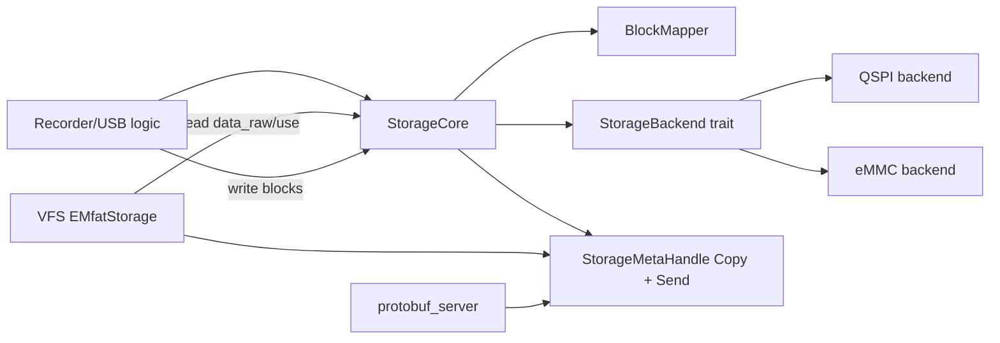
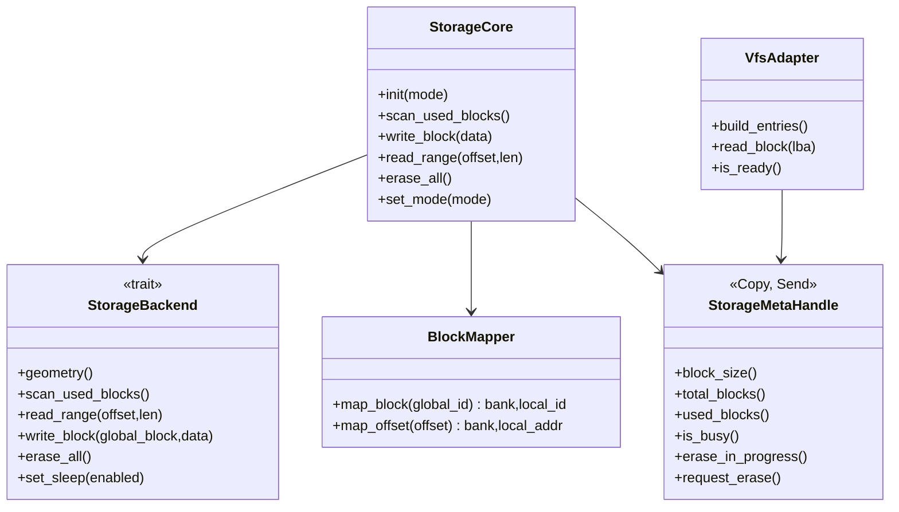
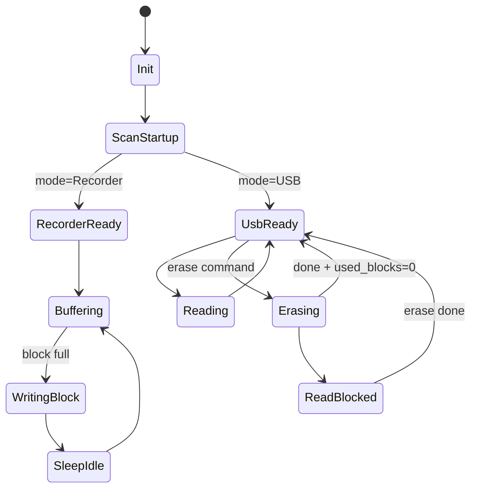
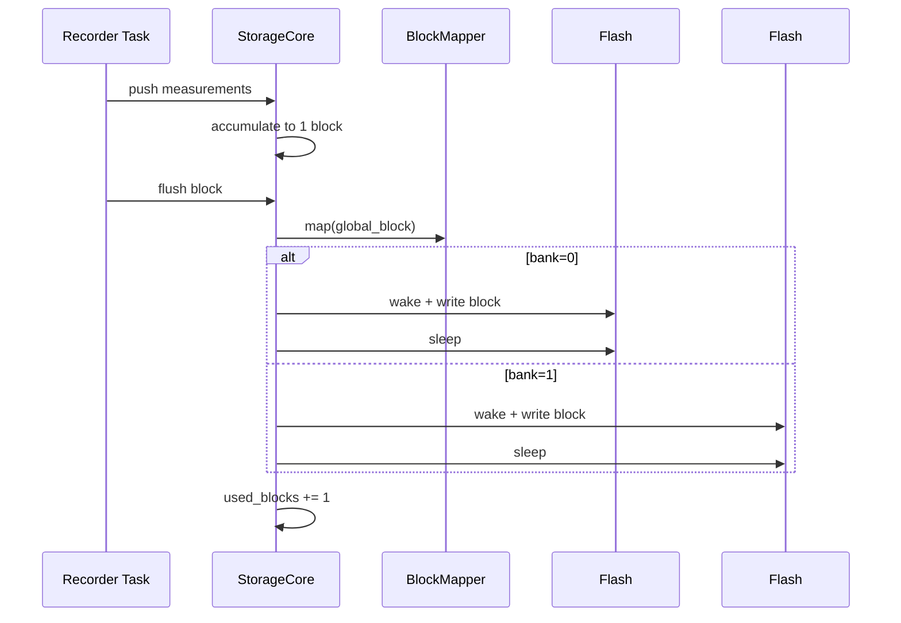
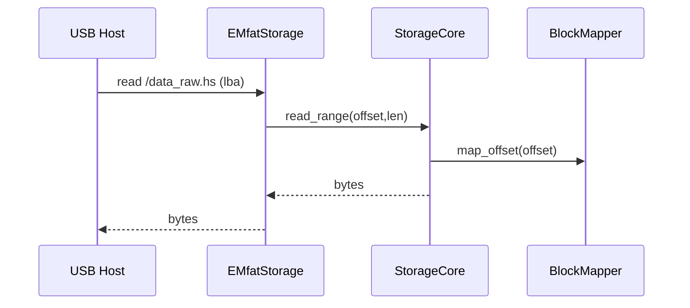
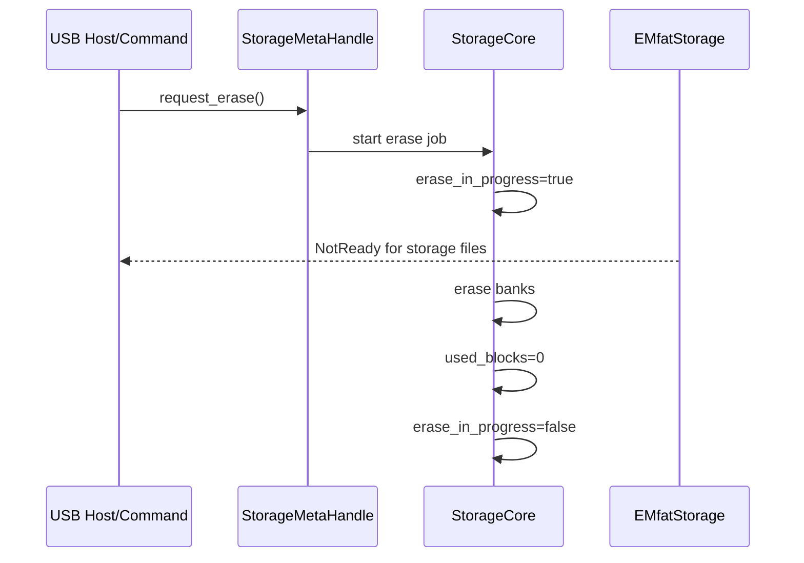

# STORAGE Plan

## Цели

1. Реализовать хранилище с записью блоками фиксированного размера (по умолчанию `4096` байт, кратно `FlashConfig.write_max_bytes`).
2. Поддержать 1 или 2 QSPI-flash, при 2 flash — «шахматное» распределение блоков.
3. Сохранить для клиента линейную модель блоков `0,1,2...` независимо от числа flash.
4. В режиме самописца: однократный стартовый scan, затем только запись; между операциями flash в sleep.
5. В режиме USB: чтение через VFS + memory-mapped оптимизация; разрешить только команду полного стирания.
6. Дать `Copy + Send` meta-handle для `/storage.var` и `protobuf_server()`.
7. Сделать storage API независимым от типа носителя: текущий backend QSPI и перспективный backend eMMC должны подключаться без изменения верхнего слоя.

---

## Зафиксированные правила

- **Block size**: `4096` байт (конфигурируемо, но обязательно кратно `write_max_bytes`).
- **Recorder mode**:
  - накопление данных на 1 блок в RAM;
  - запись готового блока;
  - flash спит в простое;
  - если 2 flash — запись по очереди между банками.
- **USB mode**:
  - при старте выполняется scan для определения `used_blocks`;
  - чтение только read-only;
  - доступна команда erase всего массива;
  - во время erase чтение `/storage.var`, `/data_raw.hs`, `/data_use.hs` возвращает `BlockDeviceError::NotReady`.
- **VFS files**:
  - `/data_raw.hs` = вся доступная память (`total_blocks * block_size`)
  - `/data_use.hs` = только занятые блоки (`used_blocks * block_size`)
  - различие только в параметрах `EntryBuilder`.
- **Расширяемость backend**:
  - слой `StorageCore` и meta/VFS API не зависит от транспорта/носителя;
  - backend реализует единый контракт (`scan/read/write/erase/sleep/mmap` capabilities);
  - миграция QSPI -> eMMC не требует изменений в `protobuf_server`, `EMfatStorage` и бизнес-логике режимов.

---

## Логический маппинг блоков

### 1 flash

- `bank = 0`
- `local_block = global_block`

### 2 flash (шахматка)

- `bank = global_block % 2`
- `local_block = global_block / 2`

### Маппинг смещения файла

- `global_block = offset / block_size`
- `in_block_offset = offset % block_size`
- `local_addr = local_block * block_size + in_block_offset`

---

## Архитектура

---

## Состояния и переходы

---

## Последовательность операций

### Recorder mode

### USB mode read

### USB mode erase

---

## План реализации (по шагам)

1. **Domain types и контракты**
  - Ввести `StorageMode`, `StorageError`, `StorageGeometry`, `StorageStats`.
   - Ввести `StorageMetaHandle` (`Copy + Send`) на атомиках.
  - Ввести `StorageBackend` trait как стабильный контракт для QSPI/eMMC.

2. **Mapper и геометрия**
   - Реализовать `BlockMapper` для 1/2 flash.
   - Вынести функции `map_block`, `map_offset`, `raw_size_bytes`, `used_size_bytes`.

3. **StorageCore**
  - Поднять core-объект с generic backend (`StorageBackend`).
   - Реализовать startup scan (`scan_used_blocks`) с поиском первого пустого блока.
   - Реализовать запись блока в recorder policy (wake/write/sleep).

4. **Erase pipeline (USB only)**
   - Реализовать `request_erase()` через meta-handle.
   - Во время erase поднимать `erase_in_progress`, по завершению `used_blocks=0`.

5. **VFS integration**
   - Вернуть `/storage.var`, `/data_raw.hs`, `/data_use.hs`.
   - Размеры файлов брать из meta-handle.
   - В `read_block` возвращать `BlockDeviceError::NotReady` для storage-файлов во время erase.

6. **Init integration**
   - Создавать `StorageCore` и `StorageMetaHandle` в `self_writer::app::init()`.
   - Передавать meta-handle в VFS и `protobuf_server`.

7. **Проверка и наблюдаемость**
   - Логи по mode/startup scan/map/erase transitions.
   - Sanity checks: границы адресов, выравнивание размеров, consistency `used <= total`.

---

## Критерии готовности (DoD)

- В recorder mode блоки пишутся поочередно по банкам (если 2 flash) и остаются линейными для клиента.
- В USB mode `data_raw.hs` и `data_use.hs` имеют корректные размеры.
- При erase чтение storage-файлов даёт `NotReady`.
- После erase `used_blocks == 0`.
- Meta-handle доступен из VFS и `protobuf_server`, не блокирует чтение.
- `cargo check --release --features maket,xtal-24mhz` проходит.
