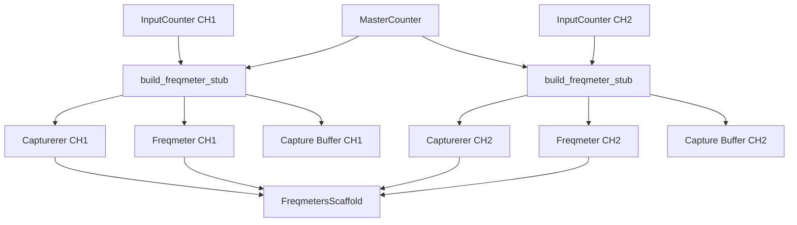
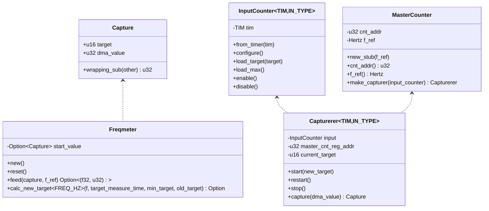
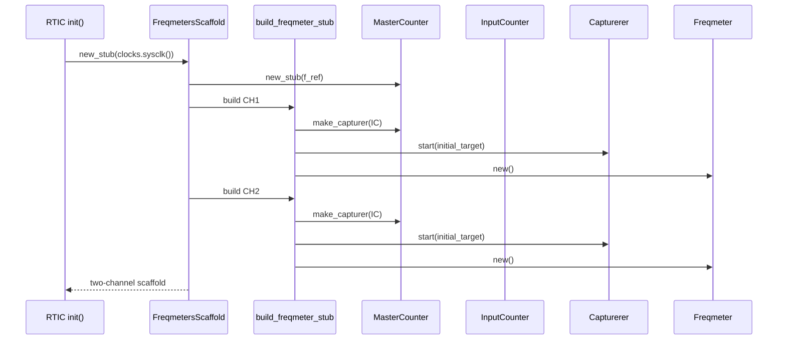
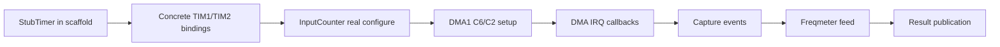

# Freqmeter Module (Port Scaffold)

This module is a copy-first port of the frequency measurement system from `SensorsStm32F0x2` into the new `self-writer` application.

Current status:
- Algorithmic core is ported.
- Two-channel initialization scaffold exists.
- STM32L433 hardware integration is intentionally partial (stubbed where needed).

## Goals

- Keep the core measurement logic close to source behavior.
- Avoid reusing legacy `old_freqmeter` public API patterns.
- Expose a clean, incremental path from scaffold to full hardware implementation.

## Module Structure

Files in this module:
- `capture.rs`: capture sample container and wrapping subtraction helper.
- `freqmeter.rs`: main frequency computation logic and adaptive target helper.
- `capturerer.rs`: adapter between input counter and captured master counter value.
- `input_counter.rs`: generic input counter abstraction.
- `tim_input_config_helper.rs`: timer configuration and control traits.
- `dma_traits.rs`: lightweight DMA address/read marker traits.
- `master_counter.rs`: master counter facade (currently stub-oriented).
- `scaffold.rs`: two-channel scaffold and `build_freqmeter_stub` constructor.
- `mod.rs`: module exports.

## Architecture Overview



## Data Model



## Runtime Flow (Current Scaffold)



## Relation to Source Macro `build_freqmeter`

Source project used a macro that packed several steps together:
- Build capturer from master timer + input timer.
- Prepare DMA transfer buffer and source address.
- Start capturer with initial target.
- Construct `Freqmeter` instance.

In this port, that pattern is represented as explicit code in:
- `build_freqmeter_stub` (in `scaffold.rs`).

This keeps migration readable and testable before final STM32L433 register-level wiring.

## Integration Point

The scaffold is currently wired into:
- `src/bin/self-writer/main.rs`

At init time, the application stores a two-channel `FreqmetersScaffold` in local RTIC state.

## Known Gaps / TODO

Hardware-specific TODOs for STM32L433:
- Real master counter overflow handling (`TIM6/TIM7`) in `master_counter.rs`.
- Real timer register programming in `TimerInputConfig` / `TimerControl` implementations.
- Real DMA channel configuration and IRQ callbacks.
- Replacing `StubTimer` with concrete timer types and input pins.

Behavioral TODOs:
- Connect capture events to processing task(s).
- Push measurement results into the new data pipeline.
- Add per-channel runtime controls (start/stop/restart/target updates).

## STM32L433 Pin/DMA Mapping (Working Draft)

This table is a practical migration map for replacing current stubs with real L433 bindings.

| Logical channel   | Input pin type                | Timer  | Timer input mode | DMA channel | DMA IRQ    | DMA CSELR map            |
| ----------------- | ----------------------------- | ------ | ---------------- | ----------- | ---------- | ------------------------ |
| Pressure (CH1)    | `PA8<Alternate<PushPull, 1>>` | `TIM1` | `TI1FP1`         | `DMA1 C6`   | `DMA1_CH6` | `C6S = map7` (`TIM1_UP`) |
| Temperature (CH2) | `PA0<Alternate<PushPull, 1>>` | `TIM2` | `TI1FP1`         | `DMA1 C2`   | `DMA1_CH2` | `C2S = map4`             |

Master counter draft mapping:

| Role              | Timer  | IRQ        | Notes                        |
| ----------------- | ------ | ---------- | ---------------------------- |
| Master counter #0 | `TIM6` | `TIM6_DAC` | Overflow extension source    |
| Master counter #1 | `TIM7` | `TIM7`     | Alternative/secondary source |

### Enable Sequence Checklist

- Implement concrete `TimerInputConfig` and `TimerControl` for chosen timer register blocks.
- Replace `StubTimer` usage in `scaffold.rs` with real timer-backed `InputCounter` instances.
- Configure `DMA1 C6` and `DMA1 C2` transfer source to master counter `CNT` address.
- Wire DMA IRQ handlers (`DMA1_CH6`, `DMA1_CH2`) and publish capture events to processing path.
- Implement `master_ovf` with `TIM6/TIM7` overflow extension logic.
- Validate debug-freeze behavior for active timers in debug profile.

### Stub-to-Real Transition Diagram



## Minimal Usage Sketch

```rust
use stm32_usb_self_writer::sensors::freqmeter::FreqmetersScaffold;

let freqmeters = FreqmetersScaffold::new_stub(master_counter_freq);
```

## Migration Notes

- Keep this module as the single migration target for all new freqmeter work.
- Use `old_freqmeter` only as a hardware reference, not as API source.
- Prefer small, compile-safe steps: add concrete hardware bindings one block at a time.
